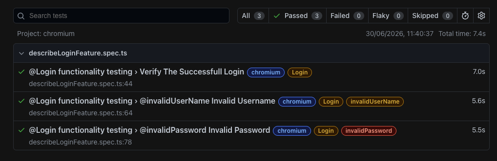
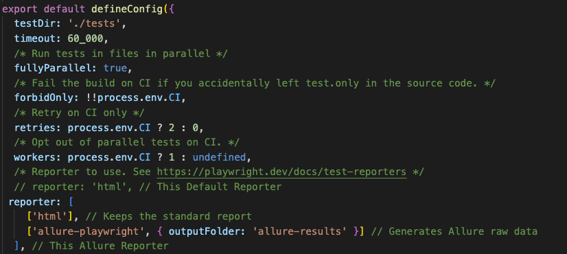

# Important command of playwright
- 

# Allure Reporting 
- Install Allure Report node Package : npm install --save-dev allure-playwright 
-  
   reporter: [ 
   ['html'], // Keeps the standard report 
   ['allure-playwright', { outputFolder: 'allure-results' }] // Generates Allure raw data 
   ],
- npx playwright test (Run the test)
- npx allure-commandline generate allure-results --clean -o allure-report
- npx allure-commandline open allure-report

